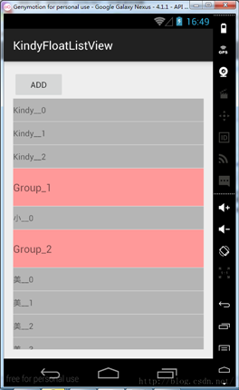
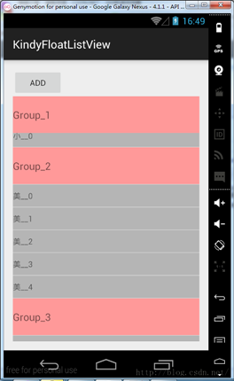
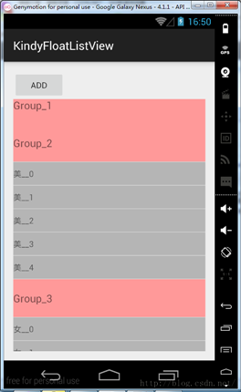

## ListView分类标题悬浮


# 说明
总的来说就是在ListView的顶部放置一个悬浮的View，用来显示分组信息，
再对ListView设置滑动监听，public void setOnScrollListener(OnScrollListener l)，
然后在OnScrollListener里实现具体逻辑。下面是效果图：
<br>



# 使用
定义自己的Adapter继承BaseListFloatViewAdapter，实现isGroup(int position)方法
```java
public class MyAdapter extends BaseListFloatViewAdapter<Bean> {
  ...
  @Override
  public boolean isGroup(int position) {
      Bean bean = mData.get(position);
      return bean.isGroup;
  }
  ...
}
```
